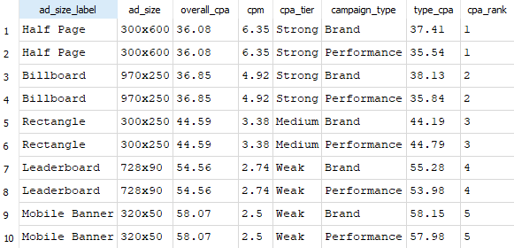

# Programmatic Advertising: Ad Size vs CPA Analysis

**SQL portfolio project — paid media analyst**

I wish I could have used real data, unfortunately that's quite difficult to gain access to. As such, I instructed Claude to generate fictional programmatic advertising campaign datasets.
Using these fictional, albeit realistic and comprehensive, datasets, I will demonstrate analytical SQL skills in a paid media context. The central question: **Which ad size performs best in terms of CPA (cost per acquisition), and does that relationship hold across campaign types?**

---

## Project structure

```
programmatic_ads_db.sql   ← full schema + 513 rows of data
README.md                 ← this file
```

---

## Database schema

Four related tables, designed to mirror a real programmatic reporting structure.

```
publishers          campaigns
───────────         ─────────────
publisher_id   ←─┐  campaign_id   ←─┐
publisher_name   │  campaign_name   │
category         │  campaign_type   │
tier             │  budget          │
                 │  start_date      │
                 │  end_date        │
                 │  strategy        │
                 │                  │
          placements                │
          ──────────                │
          placement_id              │
          campaign_id  ────────────-┘
          publisher_id ─────────────┘
          ad_size
          ad_size_label
                 │
          daily_performance
          ─────────────────
          row_id
          placement_id  ←── (joins back to placements)
          campaign_id
          report_date
          impressions
          clicks
          conversions
          spend
          cpm
```

**Ad sizes included:** 728x90 Leaderboard, 300x250 Rectangle, 160x600 Skyscraper, 320x50 Mobile Banner, 300x600 Half Page, 970x250 Billboard

**Publishers:** 8 fictional publishers across News, Sports, Tech, Finance, Lifestyle, Entertainment, Travel and Health — classified into Premium, Standard and Long-tail tiers.

**Campaigns:** 6 campaigns spanning Q1–Q4 2024, split across Brand and Performance types, using Prospecting and Retargeting strategies.

---

## Key findings

### Overall CPA by ad size (conversions > 100 threshold applied)

| Ad size | Label | Overall CPA | CPM | Conversions | Tier |
|---|---|---|---|---|---|
| 300x600 | Half Page | $36.08 | $6.35 | 517 | Strong |
| 970x250 | Billboard | $36.85 | $4.92 | 154 | Strong |
| 300x250 | Rectangle | $44.59 | $3.38 | 249 | Medium |
| 728x90 | Leaderboard | $54.56 | $2.74 | 268 | Weak |
| 320x50 | Mobile Banner | $58.07 | $2.50 | 165 | Weak |
| 160x600 | Skyscraper | $67.65 | $1.83 | 62 | — (excluded) |

*The 160x600 Skyscraper is excluded from the primary analysis: with only 62 total conversions across the dataset, the CPA estimate lacks statistical reliability. The small conversion volume also reflects a real-world constraint — as a former senior programmatic campaign manager I know that Skyscraper inventory is historically limited in RTB environments.*

### Headline insight

The 300x600 Half Page costs $6.35 CPM yet delivers the cheapest conversions at $36.08 CPA. **Premium inventory is not just more expensive: it converts at a rate that more than covers the price premium.** The Leaderboard is cheap to buy but generates almost no action.

The CPA spread across sizes is 87% ($36 to $68). In a real campaign this would be a material budget reallocation decision: shifting spend from Skyscraper and Mobile Banner into Half Page and Billboard inventory could reduce overall CPA by an estimated 25–35%.

---

## Centrepiece query

This single query demonstrates the core analytical SQL skills used for this project.

```sql
WITH Cross_campaign AS (
    SELECT
        placements.ad_size,
        placements.ad_size_label,
        SUM(daily_performance.impressions)                                             AS total_impressions,
        SUM(daily_performance.conversions)                                             AS total_conversions,
        ROUND(SUM(daily_performance.spend) / NULLIF(SUM(daily_performance.conversions), 0), 2) AS cpa,
        SUM(daily_performance.spend)                                                   AS total_spend
    FROM placements
    LEFT JOIN daily_performance
        ON placements.placement_id = daily_performance.placement_id
       AND placements.campaign_id  = daily_performance.campaign_id
    GROUP BY placements.ad_size, placements.ad_size_label
    HAVING SUM(daily_performance.conversions) > 100
),
By_campaign_type AS (
    SELECT
        campaign_type,
        ad_size,
        ad_size_label,
        type_conversions,
        type_cpa,
        RANK() OVER (
            PARTITION BY campaign_type
            ORDER BY type_cpa ASC
        ) AS cpa_rank
    FROM (
        SELECT
            campaigns.campaign_type,
            placements.ad_size,
            placements.ad_size_label,
            SUM(daily_performance.conversions)                                             AS type_conversions,
            ROUND(SUM(daily_performance.spend) / NULLIF(SUM(daily_performance.conversions), 0), 2) AS type_cpa
        FROM placements
        LEFT JOIN daily_performance
            ON placements.placement_id = daily_performance.placement_id
        LEFT JOIN campaigns
            ON placements.campaign_id  = campaigns.campaign_id
        GROUP BY campaigns.campaign_type, placements.ad_size, placements.ad_size_label
        HAVING SUM(daily_performance.conversions) > 20
    )
)
SELECT
    cc.ad_size_label,
    cc.ad_size,
    cc.cpa                                                              AS overall_cpa,
    ROUND(1000.0 * cc.total_spend / NULLIF(cc.total_impressions, 0), 2) AS cpm,
    CASE
        WHEN cc.cpa <= 40 THEN 'Strong'
        WHEN cc.cpa <= 50 THEN 'Medium'
        ELSE 'Weak'
    END                                                                 AS cpa_tier,
    bct.campaign_type,
    bct.type_cpa,
    bct.cpa_rank
FROM Cross_campaign AS cc
LEFT JOIN By_campaign_type AS bct
    ON cc.ad_size = bct.ad_size
ORDER BY cc.cpa ASC, bct.campaign_type;
```

## Centrepiece query visualization




### What this query demonstrates

| Technique | Where used |
|---|---|
| CTE (WITH statement) | Two named CTEs: `Cross_campaign` and `By_campaign_type` |
| LEFT JOIN across 3 tables | placements → daily_performance → campaigns |
| GROUP BY with HAVING | Aggregate filtering conversions at two different thresholds (>100 and >20) |
| NULLIF for defensive division | Prevents division-by-zero on conversions and impressions |
| Derived metric in outer SELECT | CPM calculated from CTE columns rather than raw tables |
| CASE WHEN bucketing | CPA tier labels with thresholds |
| RANK() OVER PARTITION BY | Ad sizes ranked within each campaign type independently |

---

## Additional queries covered

The analysis also includes the following techniques, each applied to a specific analytical question:

**UNION ALL** — row count QA across all four tables to verify data loaded correctly.

**Window functions: AVG() OVER, LAG() OVER** — rolling 7-day CPM trend for the 300x600 unit, with day-on-day delta using LAG(). Identifies CPM volatility during the holiday campaign period.

**WHERE with subquery** — filters ad sizes to only those beating the portfolio average CPA, calculated inline via a scalar subquery rather than hardcoded.

**CAST for integer division** — CTR calculation using `CAST(clicks AS REAL)` to prevent SQLite truncating integer division to zero.

---

## Analytical decisions

**Why exclude sizes with fewer than 100 conversions?**
Below that threshold, a single anomalous day can swing the aggregate CPA by 10–15%, making cross-size comparisons unreliable. The 160x600 Skyscraper (62 conversions) is noted in results but excluded from the primary ranking.

**Why separate HAVING thresholds (>100 overall, >20 by campaign type)?**
Splitting by campaign type halves the available conversions per cell. Applying the same 100-conversion threshold would eliminate most of the campaign-type breakdown. The lower threshold is a deliberate trade-off — clearly documented in the query comments.

**Why RANK() rather than ROW_NUMBER()?**
RANK() assigns equal rank to tied values and skips the next position (1, 2, 2, 4). ROW_NUMBER() forces an arbitrary tiebreak. For analytical ranking where ties are meaningful, RANK() is the more honest choice.

---

## Setup

1. Download `programmatic_ads_db.sql`
2. Open [DB Browser for SQLite](https://sqlitebrowser.org/)
3. File → New Database → save as `programmatic_ads.db`
4. Open the Execute SQL tab
5. Paste the full contents of `programmatic_ads_db.sql` and run
6. Verify with:

```sql
SELECT 'publishers' AS tbl, COUNT(*) AS rows FROM publishers
UNION ALL SELECT 'campaigns',         COUNT(*) FROM campaigns
UNION ALL SELECT 'placements',        COUNT(*) FROM placements
UNION ALL SELECT 'daily_performance', COUNT(*) FROM daily_performance;
```

Expected: publishers=8, campaigns=6, placements=57, daily_performance=513

---

## Tools

- SQLite 3 via DB Browser for SQLite
- Data generated with Python (seed fixed for reproducibility)
- Realistic variance modelled on IAB programmatic benchmarks

---

*Built as a SQL portfolio project for a paid media analyst role. Once again, all data is generated by Claude, and therefore fictional.*
